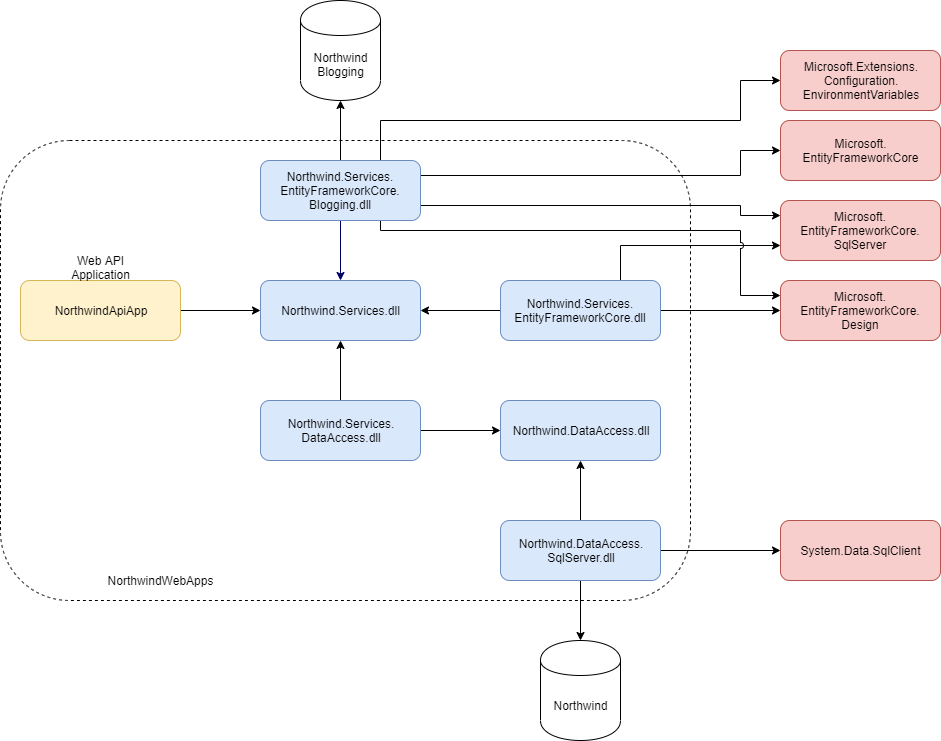

# Northwind Applications

## Модуль 5. Использование Entity Framework Core

### Цель

* Изучить Database-First и Code-First подходы.
* Научиться генерировать код сущностей и контекста для существующей базы данных.
* Научиться создавать сущности 
* Научиться реализовывать связи между сущностями при помощи атрибутов.


### Задание 1. Основы Entity Framework

Изучите материалы:

1. [Entity Framework Core](https://docs.microsoft.com/en-us/ef/core).
2. [Getting Started with EF Core](https://docs.microsoft.com/en-us/ef/core/get-started).
3. [Get the Entity Framework Core runtime](https://docs.microsoft.com/en-us/ef/core/get-started/install/#get-the-entity-framework-core-runtime).
4. [How Entity Framework Works?](https://www.entityframeworktutorial.net/basics/how-entity-framework-works.aspx)
5. [Context Class in Entity Framework](https://www.entityframeworktutorial.net/basics/context-class-in-entity-framework.aspx)
6. [What is an Entity in Entity Framework?](https://www.entityframeworktutorial.net/basics/entity-in-entityframework.aspx)


### Задание 2. Database-First

Изучите материалы:

* [Development Approaches with Entity Framework](https://www.entityframeworktutorial.net/choosing-development-approach-with-entity-framework.aspx)
* [Creating a Model for an Existing Database in Entity Framework Core](https://www.entityframeworktutorial.net/efcore/create-model-for-existing-database-in-ef-core.aspx)
* [Reverse Engineering](https://docs.microsoft.com/en-us/ef/core/managing-schemas/scaffolding)
* [Get the Entity Framework Core tools](https://docs.microsoft.com/en-us/ef/core/get-started/install/#get-the-entity-framework-core-tools)

Выберите один из методов - dotnet-ef или Scaffold-DbContext. Оба метода генерируют одинаковый код.

#### dotnet-ef

```sh
$ dotnet tool install --global dotnet-ef
$ dotnet add Northwind.Services.EntityFrameworkCore\Northwind.Services.EntityFrameworkCore.csproj package Microsoft.EntityFrameworkCore.Design
$ dotnet-ef dbcontext scaffold "data source=(localdb)\MSSQLLocalDB;Integrated Security=True;Database=Northwind;" Microsoft.EntityFrameworkCore.SqlServer --context-dir Context --context NorthwindContext --output-dir Entities --data-annotations -p Northwind.Services.EntityFrameworkCore\Northwind.Services.EntityFrameworkCore.csproj
```

#### Scaffold-DbContext

1. Solution Explorer -> Northwind.Services.EntityFrameworkCore -> Set as Startup Project (menu).
2. Откройте _Package Manager Console_.
3. Default project: Northwind.Services.EntityFrameworkCore.
4. Запустите команды:

```sh
PM> Install-Package Microsoft.EntityFrameworkCore.Tools
PM> Install-Package Microsoft.EntityFrameworkCore.Design
PM> Scaffold-DbContext -Connection "data source=(localdb)\MSSQLLocalDB;Integrated Security=True;Database=Northwind;" -Provider Microsoft.EntityFrameworkCore.SqlServer -OutputDir Entities -ContextDir Context -Context NorthwindContext -DataAnnotations
```

После генерации кода, исправьте ошибки и соберите проект. Предупреждения компилятора о необходимости документации и другие предупреждения в сгенерированных файлах можно отключить.


### Задание 3. Refactoring

#### Выполнение

1. Удалите контекст _NorthwindContext_ и модели, которые были добавлены вручную.
2. Используйте сгенерированный контект и модели для реализации сервисов в проекте.
3. Удалите метод _NorthwindContext.OnConfiguring_. Нет необходимости хранить строку подключения в контексте, так как используется файл конфигурации. См. [Connection Strings](https://docs.microsoft.com/en-us/ef/core/miscellaneous/connection-strings#aspnet-core).
4. Изучите материалы:
	* [Creating and configuring a model](https://docs.microsoft.com/en-us/ef/core/modeling)
	* [Entity Types](https://docs.microsoft.com/en-us/ef/core/modeling/entity-types)
	* [Entity Properties](https://docs.microsoft.com/en-us/ef/core/modeling/entity-properties)
	* [Keys](https://docs.microsoft.com/en-us/ef/core/modeling/keys)
	* [Relationships](https://docs.microsoft.com/en-us/ef/core/modeling/relationships)
5. Найдите код сущностей _Products_ и _Categories_, изучите их реализацию.


### Задание 4. Code-First

В этом задании нужно добавить функциональность для ведения корпоративного блога компании Northwind. Статьи будут добавлять сотрудники компании. Каждая статья может быть связана с одним или несколькими продуктами. Данные должны храниться в отдельной БД - _NorthwindBlogging_.

#### Выполнение

1. Создайте новую БД _NorthwindBlogging_.
2. Добавьте новый проект _Northwind.Services.EntityFrameworkCore.Blogging_:

```sh
dotnet new classlib --name Northwind.Services.EntityFrameworkCore.Blogging --framework netcoreapp3.1
dotnet sln NorthwindWebApps.sln add Northwind.Services.EntityFrameworkCore.Blogging\Northwind.Services.EntityFrameworkCore.Blogging.csproj
dotnet add Northwind.Services.EntityFrameworkCore.Blogging\Northwind.Services.EntityFrameworkCore.Blogging.csproj reference Northwind.Services\Northwind.Services.csproj
dotnet add NorthwindApiApp\NorthwindApiApp.csproj reference Northwind.Services.EntityFrameworkCore.Blogging\Northwind.Services.EntityFrameworkCore.Blogging.csproj
dotnet add Northwind.Services.EntityFrameworkCore.Blogging\Northwind.Services.EntityFrameworkCore.Blogging.csproj package Microsoft.CodeAnalysis.FxCopAnalyzers
dotnet add Northwind.Services.EntityFrameworkCore.Blogging\Northwind.Services.EntityFrameworkCore.Blogging.csproj package StyleCop.Analyzers
dotnet add Northwind.Services.EntityFrameworkCore.Blogging\Northwind.Services.EntityFrameworkCore.Blogging.csproj package Microsoft.EntityFrameworkCore
dotnet add Northwind.Services.EntityFrameworkCore.Blogging\Northwind.Services.EntityFrameworkCore.Blogging.csproj package Microsoft.EntityFrameworkCore.Design
dotnet add Northwind.Services.EntityFrameworkCore.Blogging\Northwind.Services.EntityFrameworkCore.Blogging.csproj package Microsoft.EntityFrameworkCore.SqlServer
dotnet add Northwind.Services.EntityFrameworkCore.Blogging\Northwind.Services.EntityFrameworkCore.Blogging.csproj package Microsoft.Extensions.Configuration.EnvironmentVariables
```



3. Добавьте файлы:

```
Northwind.Services\Blogging\BlogArticle.cs
Northwind.Services\Blogging\IBloggingService.cs
Northwind.Services.EntityFrameworkCore.Blogging\BloggingService.cs
Northwind.Services.EntityFrameworkCore.Blogging\Context\BloggingContext.cs
Northwind.Services.EntityFrameworkCore.Blogging\Context\DesignTimeBloggingContextFactory.cs
Northwind.Services.EntityFrameworkCore.Blogging\Entities\BlogArticle.cs
NorthwindApiApp\Controllers\BlogArticlesController.cs
```

4. Добавьте модель в _BlogArticle.cs_. Модель должна хранить:
	* Идентификатор статьи блога.
	* Заголовок статьи блога.
	* Текст статьи блога.
	* Дата и время опубликования статьи.
	* Идентификатор работника, который опубликовал статью в блоге.

5. Добавьте контекст _BloggingContext.cs_. Используйте _Data Annotations_, чтобы задать названия для таблиц и полей, а также установить первичный ключ. Стиль наименования - [нижний регистр+подчеркивание](https://launchbylunch.com/posts/2014/Feb/16/sql-naming-conventions/).
6. В файл _DesignTimeBloggingContextFactory.cs_ добавьте фабрику для производства контекста _BloggingContext_, который будет использован для миграций. Это необходимо, так как миграции будут размещены в отдельном проекте. См. [Add an implementation of IDesignTimeDbContextFactory](https://codingblast.com/entityframework-core-idesigntimedbcontextfactory/) и [Environment Variables Configuration Provider](https://docs.microsoft.com/en-us/aspnet/core/fundamentals/configuration#environment-variables-configuration-provider).

```sh
public class DesignTimeBloggingContextFactory : IDesignTimeDbContextFactory<BloggingContext>
{
    public BloggingContext CreateDbContext(string[] args)
    {
        const string connectionStringName = "NORTHWIND_BLOGGING";
        const string connectioStringPrefix = "SQLCONNSTR_";

        var configuration = new ConfigurationBuilder().AddEnvironmentVariables().Build();
        var connectionString = configuration.GetConnectionString(connectionStringName);

        if (string.IsNullOrEmpty(connectionString))
        {
            throw new Exception($"{connectioStringPrefix}{connectionStringName} environment variable is not set.");
        }

        Console.WriteLine($"Using {connectioStringPrefix}{connectionStringName} environment variable as a connection string.");

        var builderOptions = new DbContextOptionsBuilder<BloggingContext>().UseSqlServer(connectionString).Options;
        return new BloggingContext(builderOptions);
    }
}
```

Строка подключения передается в фабрику через переменную окружения, поэтому необходимо установить переменную до вызова команды _dotnet-ef_.

7. Создайте первоначальную миграцию и примените ее к БД:

```sh
$ set SQLCONNSTR_NORTHWIND_BLOGGING=data source=(localdb)\MSSQLLocalDB; Integrated Security=True; Initial Catalog=NorthwindBlogging;
$ dotnet-ef migrations add InitialCreate --project Northwind.Services.EntityFrameworkCore.Blogging\Northwind.Services.EntityFrameworkCore.Blogging.csproj --context BloggingContext -v
$ dotnet ef database update --project Northwind.Services.EntityFrameworkCore.Blogging\Northwind.Services.EntityFrameworkCore.Blogging.csproj --context BloggingContext
```

8. Спроектируйте API для статей блога:

| Operation        | HTTP Verb | URI                | Request body | Response body |
| ---------------- | --------- | ------------------ | ------------ | ------------- |
| Create           |           | /api/articles      |              |               |
| Read (all items) |           | /api/articles      |              |               |
| Read (item)      |           | /api/articles/{id} |              |               |
| Update           |           | /api/articles/{id} |              |               |
| Delete           |           | /api/articles/{id} |              |               |

9. Добавьте реализацию в _BlogArticle_, _IBloggingService_, _BloggingService_ и _BlogArticlesController_ для операции Create. Дата и время добавления статьи вычисляются автоматически на основе системного времени сервера, на котором происходит запуск back-end приложения.

Структура JSON payload:

```json
{
	"title": "Gourmet Quality: Mascarpone Fabioli",
	"text": "A text that describes Mascarpone Fabioli...",
	"authorId": 1
}
```

_authorId_ сотрудника - это _Employees.EmployeeID_ в БД _Northwind_. При добавлении статьи требуется проверка на наличие такого идентификатора в таблице.

10. Реализуйте операцию Delete.

11. Добавьте реализацию для операции Read (all items), которая должна возвращать краткую информацию по всем статьям. Порядок полей в структуре неважен.

Структура JSON response:

```json
[
	{
		"id": 1,
		"title": "Gourmet Quality: Mascarpone Fabioli",
		"posted": "2012-04-23T18:25:43.511Z",
		"authorId": 1,
		"authorName": "Nancy Davolio, Sales Representative",
	}
]
```

 Про формат даты см. [The “right” JSON date format](https://stackoverflow.com/questions/10286204/the-right-json-date-format). Поле _authorName_ содержит данные из таблицы _Employees_ БД _Northwind_. Поиск сотрудника должен происходить по _authorId_.

12. Добавьте реализацию для операции Read (item), которая должна возвращать полную информацию о необходимой статье.

Структура JSON response:

```json
{
	"id": 1,
	"title": "Gourmet Quality: Mascarpone Fabioli",
	"posted": "2012-04-23T18:25:43.511Z",
	"authorId": 1,
	"authorName": "Nancy Davolio, Sales Representative",
	"text": "A text that describes Mascarpone Fabioli..."
}
```

13. Реализуйте операцию Update. С помощью этой операции можно изменить только заголовок и тело статьи, дата публикации должна быть обновлена автоматически.

Структура JSON payload:

```json
{
	"title": "Gourmet Quality: Mascarpone Fabioli",
	"text": "A text that describes Mascarpone Fabioli..."
}
```


### Проверочные вопросы:

* Зачем нужен метод _DbContext.OnModelCreating_?
* Что такое _Data Annotations_?
